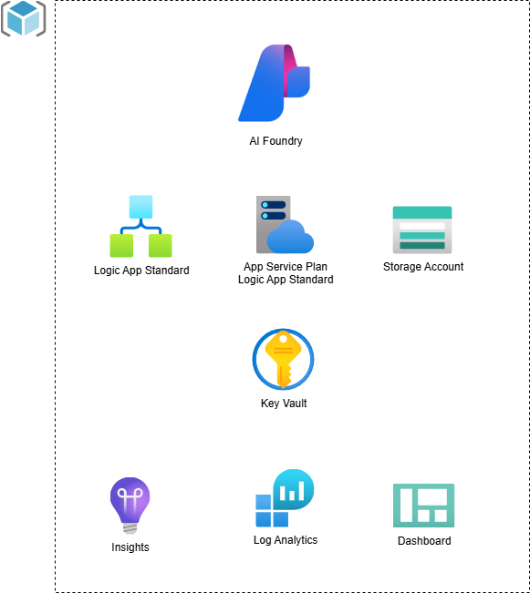
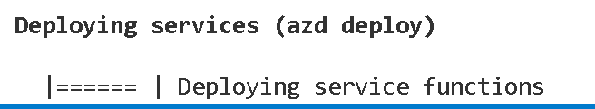

# Logic App AI Agent
### template to deploy logic app workflows as an ai agent

Logic App Standard is Microsoft's low code offering for implementing enterprise integrations. It offers [**Connectors**](https://learn.microsoft.com/en-us/azure/connectors/built-in) which can save you time from building everything yourself.

Azure Logic Apps can now integrate AI agents, which use large language models (LLMs) and an "agent loop" to perform complex, multi-step tasks autonomously. These agents can reason, make decisions, and use tools (prebuilt Logic App actions) to complete a workflow that evolves based on results. This is a new approach that complements existing structured automation with an AI-first, adaptive pattern, allowing agents to plan, act, learn, and reason within the low-code platform.

This templates includes a Logic App Standard and AI Foundry deployment.

### Application architecture



This template utilizes the following Azure resources:

- [**AI Foundry**](https://learn.microsoft.com/en-us/azure/ai-foundry/) for  for building, deploying, and managing AI and generative AI applications
- [**Azure Logic App Standard**](https://learn.microsoft.com/azure/logic-apps/) to design the workflows
- [**Azure Key Vault**](https://docs.microsoft.com/azure/key-vault/) for securing secrets
- [**Azure Monitor**](https://docs.microsoft.com/azure/azure-monitor/) for monitoring and logging

### How to get started

1. Install Visual Studio Code with Azure Logic Apps (Standard) extensions
1. Create a new folder and switch to it in the Terminal tab
1. Run `azd auth login`
1. Run `azd init -t https://github.com/marnixcox/logicapp-ai-agent`

Now the magic happens. The template contents will be downloaded into your project folder. This will be the next starting point for building your AI agents.

### Contents

The following folder structure is created. 

```
├── infra                      [ Infrastructure As Code files ]
│   ├── aifoundry              [ AI Foundry files ]
│   ├── keyvault               [ Key Vault files ]
│   ├── logicapp               [ Logic app files ]
│   ├── storage                [ Storage files ]
│   ├── main.bicep             [ Main infrastructure file ]
│   └── main.parameters.json   [ Parameters file ]
├── src                        [ Application code ]
│   └── workflows              [ Azure Logic App Standard ]
└── azure.yaml                 [ Describes the app and type of Azure resources ]

```

### Key Infrastructure Files
- `aifoundry/aifoundry.bicep` - AI Foundry
- `aifoundry/role-assignment.bicep` - To give Logic Apps access to AI Foundry
- `keyvault/keyvault.bicep` - Key Vault
- `logicapp/plan.bicep` - Logic App Plan 
- `logicapp/workflows.bicep` - Logic App Standard
- `storage/storage.bicep` - Storage account for Logic App  
- `main.bicep` - Main orchestration
- `monitoring.bicep` - Observability stack
- `resources.bicep` - Resource collection

### Provision Infrastructure 

Let's first provision the infra components. Add a `resourceToken` parameter to the `main.parameters.json` to set the application name or leave it out to have a random name generated.

```
 "resourceToken": {
      "value": "appname"
    }
```

- Run `azd provision`

First time an environment name, subscription and location need to be selected. These will then be stored in the `.azure` folder.


Resource group and all components will be created.


### Deploy Contents 

After creating Azure Logic App Standard workflows these can be deployed with another single command.

- Run `azd deploy`

Workflows will be deployed into the existing infra components.



### Connections

In order to setup the AI Foundry Connections in the [**connections.json**](https://learn.microsoft.com/en-us/azure/logic-apps/devops-deployment-single-tenant-azure-logic-apps) file the following parameters are available in the Logic App Standard instance:

`AI_FOUNDRY_NAME`
`AI_FOUNDRY_ENDPOINT`
`AI_PROJECT_NAME`
`AI_PROJECT_ENDPOINT`


